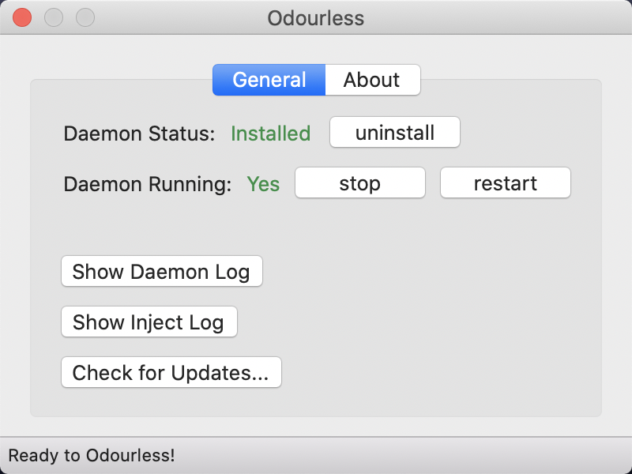

# odourless


[English README](README.md)

Odourless是一个禁止MacOS系统生成.DS_Store的工具. 

支持 10.12 到 Big Sur

**每次升级Odourless后，请手动重新安装daemon**

**当前是非稳定版, 使用需自行承担风险.**

# 预览


# 如何工作

使用 `frida-core` 注入 `Finder.app` 进程, 通过 `frida-gum` 来替换部分系统调用, 包括 `open`, `openx_np`, `getattrlist`, `setattrlist`.

每当 `Finder` 尝试调用这些方法且传入的路径是一个 `.DS_Store` 文件, 它将会将其替换为一个假的路径, 位于 `/usr/local/var/.odourless_cage`.

正如你看到的, `.DS_Store` 并不会被删除, 因此你的文件夹视图功能依然可以正常工作. 它只是将 `.DS_Store` 放到了一个你不需要关心的目录.

非常感谢 [@darwin](https://github.com/darwin) 和 [@JK3Y](https://github.com/JK3Y) 的帮助!

此项目脱胎于 [binaryage/asepsis](https://github.com/binaryage/asepsis) 和 [JK3Y/asepsis](https://github.com/JK3Y/asepsis)

更多关于实现的细节, 参见 [https://github.com/JK3Y/asepsis/issues/25](https://github.com/JK3Y/asepsis/issues/25) 里的讨论内容.

# 如何使用

## 安装

从release页面下载应用.

将 `Odourless.app` 移动至 `/Applications` 目录以安装, 打开后点击 `install` 安装守护进程.

之后每次重启, `odourless-daemon` 将会自动启动.

## 关闭SIP

使用此应用, 你必须关闭SIP.

1. 点击顶部菜单栏苹果图标
2. 点击重启...
3. 按住 Command-R 启动到恢复模式
4. 点击 Utilities(实用工具).
5. 选择 Terminal(终端).
6. 输入 `csrutil disable` 并按回车. (可能需要输入密码)
7. 重启

# 如何构建

对于构建Odourless, `xcode` 不是必要的. 但至少需要安装 `Command Line Tools`. 

输入命令 `xcode-select --install` 来安装 `Command Line Tools`.

还需要 `cmake`.

输入命令 `brew install cmake` 来安装 `cmake`.

```bash
git clone --recursive https://github.com/xiaozhuai/odourless
cd odourless
./download-frida-libs.sh
cmake -DCMAKE_BUILD_TYPE=Release -DCMAKE_OSX_ARCHITECTURES=x86_64 -B build .
cmake --build build -- install -j8
open build/dist
```

# 模块功能

## Odourless.app

Odourless.app 仅仅是一个用于安装/卸载和管理 `odourless-daemon` 的图形界面工具.

## odourless-daemon

一个用于将 `libodourless-inject.dylib` 注入到 `Finder` 进程的守护进程.
它会监听 `Finder` 是否重启, 并在 `Finder` 重启后重新注入.

## odourless-ctl

和 Odourless.app 的功能相同, 命令行方式管理 `odourless-daemon` 的工具. 如果你更喜欢命令行的话. (暂不可用)

## libodourless-inject.dylib

替换 `Finder` 进程中的部分系统调用.
